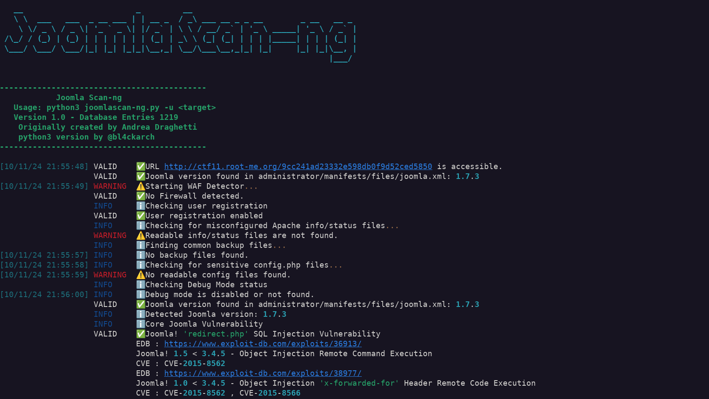
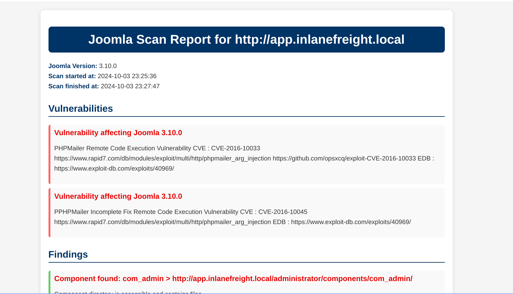

# JoomlaScan-ng

A free and open-source tool to detect installed components on Joomla CMS sites, built as a modern alternative to Joomscan  rewritten in python3 with some colorations

## Features

- Scan Joomla CMS sites to identify installed components and extensions (database with over 600 components)
- Detect browsable component directories (`Index of ...`)
- Find disabled or protected components
- Identify files that help determine the component version (e.g., README, Manifest, License, Changelog)
- Locate `robots.txt` and `error_log` files
- Support for HTTP and HTTPS connections
- Configurable connection timeout

## Upcoming Features

- User-configurable connection timeout
- Vulnerable component database integration
- Dockerfile
- Proxied Requests 

## Usage

```bash
usage: python3 joomlascan-ng.py [-h] [-u URL] [-t THREADS] [-v]
```

### Optional Arguments:

| Argument | Description |
| --- | --- |
| `-h, --help` | Show help message and exit |
| `-u URL, --url URL` | The Joomla URL/domain to scan |
| `-t THREADS, --threads THREADS` | Number of threads to use (default: 10) |
| `-v, --version` | Display the version number and exit |
| `-d, --debug` | Display debug requests during execution |


## Screenshot

- Example scan  


- Example output file in html



## Requirements

- Python 3
```bash
$ sudo pip install -r requirements.txt
```

## Changelog

- **2016.12.12** - Version 0.5beta: Multi-threading support added, database updated (656 to 686 components), minor bug fixes.
- **2016.05.20** - Version 0.4beta: Support for `README.md`, `Manifest.xml`, detection of descriptive index files, custom User-Agent, configurable timeout, database update (587 to 656 components), minor fixes.
- **2016.03.18** - Version 0.3beta: Detection of index files in component directories.
- **2016.03.14** - Version 0.2beta: Detection of administrator components and important files like Readme, Changelog, License.
- **2016.02.12** - Version 0.1beta: Initial release.
- **2024.03.10** - Version 1.0: python3 release

## License

Licensed under the GNU General Public License v3.0.

